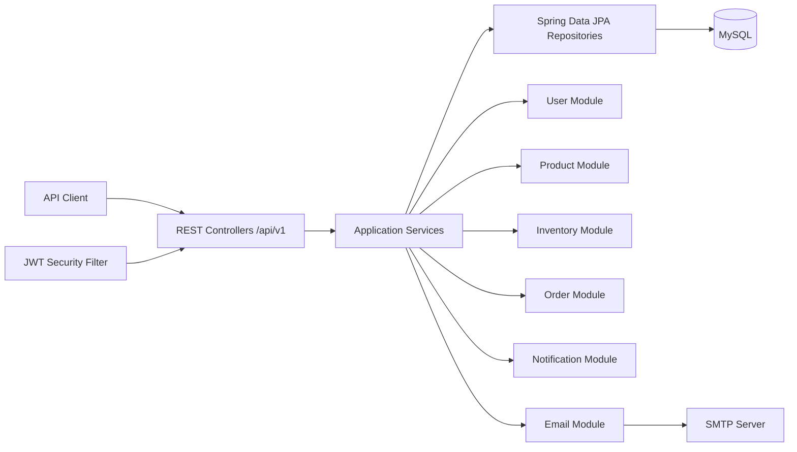

# Architecture

## Design Decisions

- Monolithic architecture keeps transaction boundaries simple while still separating features by package.
- Controllers only validate and delegate. Business logic lives in services.
- DTOs are used for every request/response. Entities are never exposed directly.
- MapStruct centralizes DTO mapping and keeps controller code clean.
- MySQL is the system of record. Hibernate can create/update local tables, and `database/schema.sql` is provided as the reference script.
- Inventory uses optimistic locking with a `version` column, plus transactional stock reserve/release methods to prevent overselling.
- Orders reserve inventory in the same transaction that creates the order, so failures roll back both order rows and inventory changes.
- Emails are triggered from business flows but sent asynchronously through Spring async support, with success/failure stored in email logs.
- Security is stateless JWT with persisted refresh tokens and BCrypt password hashing.
- Correlation IDs are added to every request and log line for traceability.
