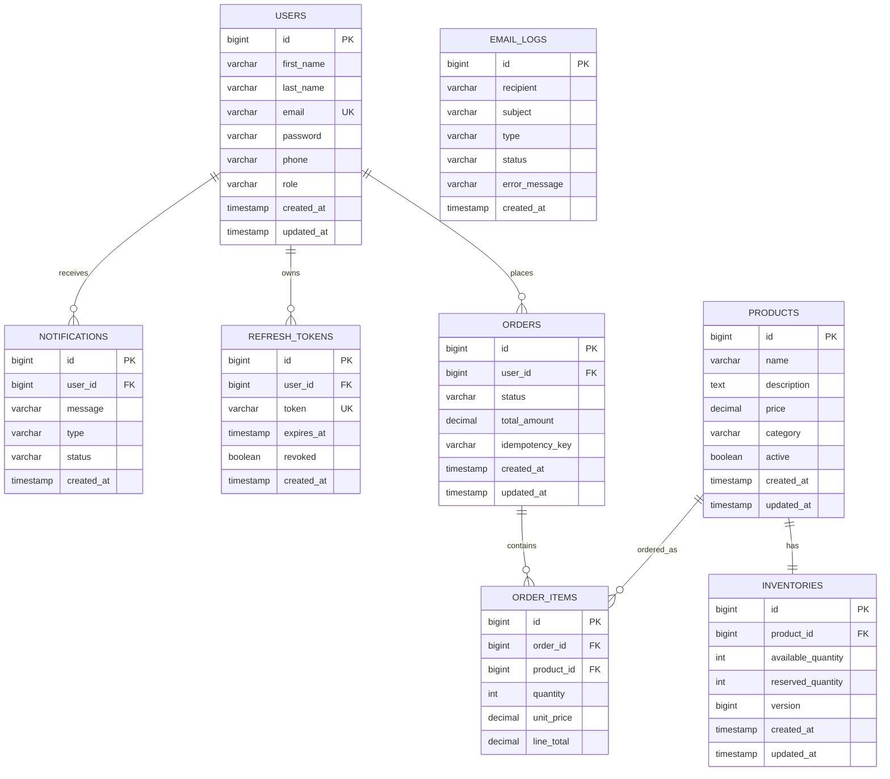

# ER Diagram

```mermaid
erDiagram
    USERS ||--o{ ORDERS : places
    USERS ||--o{ REFRESH_TOKENS : owns
    USERS ||--o{ NOTIFICATIONS : receives
    PRODUCTS ||--|| INVENTORIES : has
    PRODUCTS ||--o{ ORDER_ITEMS : ordered_as
    ORDERS ||--o{ ORDER_ITEMS : contains

    USERS {
        bigint id PK
        varchar first_name
        varchar last_name
        varchar email UK
        varchar password
        varchar phone
        varchar role
        timestamp created_at
        timestamp updated_at
    }

    PRODUCTS {
        bigint id PK
        varchar name
        text description
        decimal price
        varchar category
        boolean active
        timestamp created_at
        timestamp updated_at
    }

    INVENTORIES {
        bigint id PK
        bigint product_id FK
        int available_quantity
        int reserved_quantity
        bigint version
        timestamp created_at
        timestamp updated_at
    }

    ORDERS {
        bigint id PK
        bigint user_id FK
        varchar status
        decimal total_amount
        varchar idempotency_key
        timestamp created_at
        timestamp updated_at
    }

    ORDER_ITEMS {
        bigint id PK
        bigint order_id FK
        bigint product_id FK
        int quantity
        decimal unit_price
        decimal line_total
    }

    REFRESH_TOKENS {
        bigint id PK
        bigint user_id FK
        varchar token UK
        timestamp expires_at
        boolean revoked
        timestamp created_at
    }

    EMAIL_LOGS {
        bigint id PK
        varchar recipient
        varchar subject
        varchar type
        varchar status
        varchar error_message
        timestamp created_at
    }

    NOTIFICATIONS {
        bigint id PK
        bigint user_id FK
        varchar message
        varchar type
        varchar status
        timestamp created_at
    }
```
