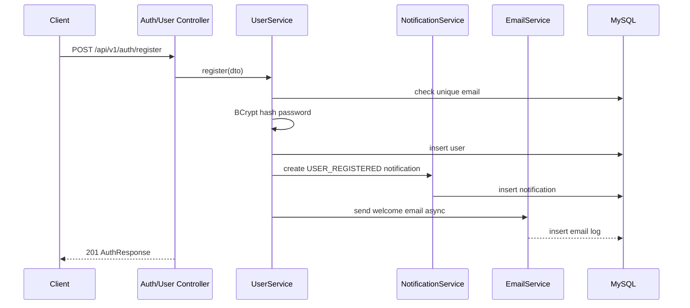
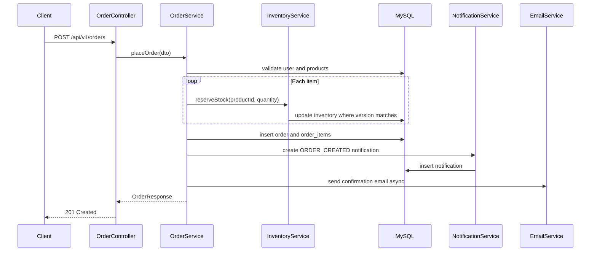
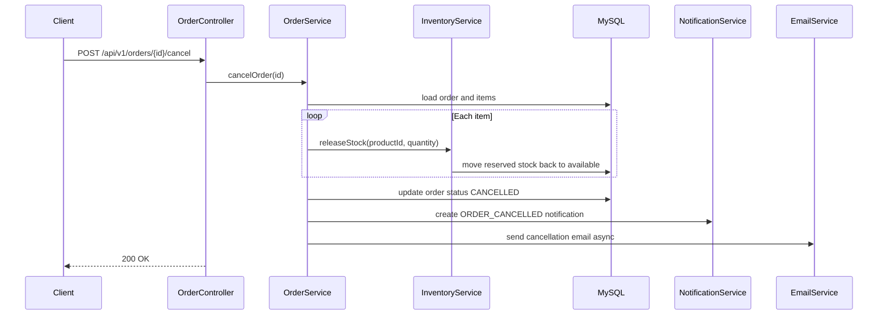

# Sequence Diagrams

## Register User

```mermaid
sequenceDiagram
    participant C as Client
    participant A as Auth/User Controller
    participant U as UserService
    participant N as NotificationService
    participant E as EmailService
    participant DB as MySQL

    C->>A: POST /api/v1/auth/register
    A->>U: register(dto)
    U->>DB: check unique email
    U->>U: BCrypt hash password
    U->>DB: insert user
    U->>N: create USER_REGISTERED notification
    N->>DB: insert notification
    U->>E: send welcome email async
    E-->>DB: insert email log
    A-->>C: 201 AuthResponse
```

## Place Order

```mermaid
sequenceDiagram
    participant C as Client
    participant O as OrderController
    participant S as OrderService
    participant I as InventoryService
    participant DB as MySQL
    participant N as NotificationService
    participant E as EmailService

    C->>O: POST /api/v1/orders
    O->>S: placeOrder(dto)
    S->>DB: validate user and products
    loop Each item
        S->>I: reserveStock(productId, quantity)
        I->>DB: update inventory where version matches
    end
    S->>DB: insert order and order_items
    S->>N: create ORDER_CREATED notification
    N->>DB: insert notification
    S->>E: send confirmation email async
    S-->>O: OrderResponse
    O-->>C: 201 Created
```

## Cancel Order

```mermaid
sequenceDiagram
    participant C as Client
    participant O as OrderController
    participant S as OrderService
    participant I as InventoryService
    participant DB as MySQL
    participant N as NotificationService
    participant E as EmailService

    C->>O: POST /api/v1/orders/{id}/cancel
    O->>S: cancelOrder(id)
    S->>DB: load order and items
    loop Each item
        S->>I: releaseStock(productId, quantity)
        I->>DB: move reserved stock back to available
    end
    S->>DB: update order status CANCELLED
    S->>N: create ORDER_CANCELLED notification
    S->>E: send cancellation email async
    O-->>C: 200 OK
```
